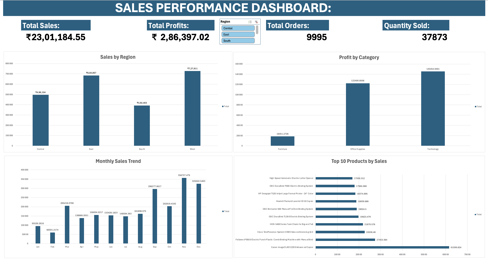

# Sales Performance Dashboard using Excel

## Project Overview
This project is an interactive Sales Performance Dashboard built using Microsoft Excel.  
The dashboard helps analyze sales performance across different regions, categories, products, and monthly trends using visualizations and KPI metrics.

The goal of this project was to transform raw sales data into meaningful business insights using Excel dashboarding techniques.


## Tools & Features Used
- Microsoft Excel
- Pivot Tables
- Pivot Charts
- Slicers
- KPI Cards
- Data Cleaning
- Data Visualization

## Dashboard Features
- Total Sales KPI
- Total Profit KPI
- Total Orders KPI
- Total Quantity KPI
- Sales by Region Analysis
- Profit by Category Analysis
- Monthly Sales Trend Analysis
- Top 10 Products Analysis
- Interactive Region Slicer


## Key Insights
- Some regions generated significantly higher sales than others.
- Certain product categories produced higher profits.
- Monthly sales trends showed fluctuations across the year.
- Top-performing products contributed major revenue to the business.


## Dataset Information
The dataset contains:
- Order ID
- Order Date
- Region
- Category
- Product Name
- Sales
- Profit
- Quantity


## Skills Demonstrated
- Data Cleaning
- Data Analysis
- Dashboard Creation
- KPI Reporting
- Business Insight Generation
- Interactive Dashboarding


## Project Structure
```text
Raw_Data
Sales_Region_Pivot
Profit_Category_Pivot
Monthly_Trend_Pivot
Top_Products_Pivot
Dashboard
```


## Dashboard Screenshot



---

## Author
Pavan Adithya
